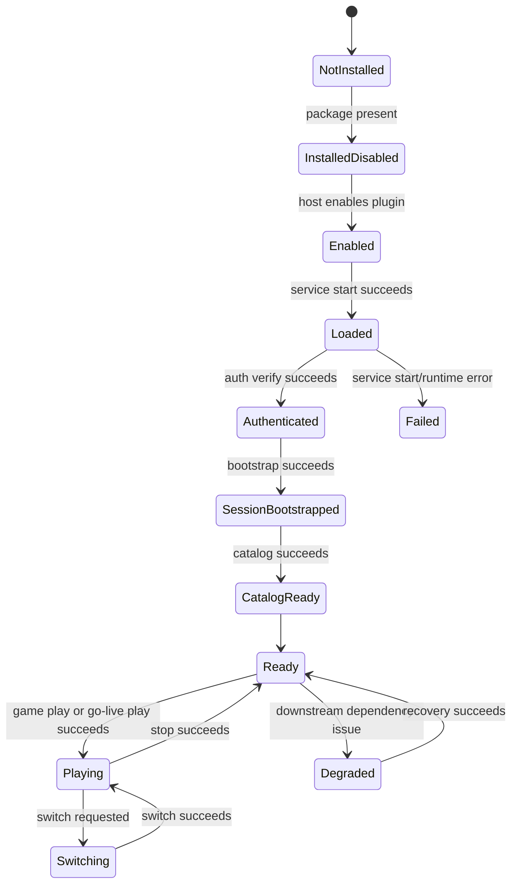
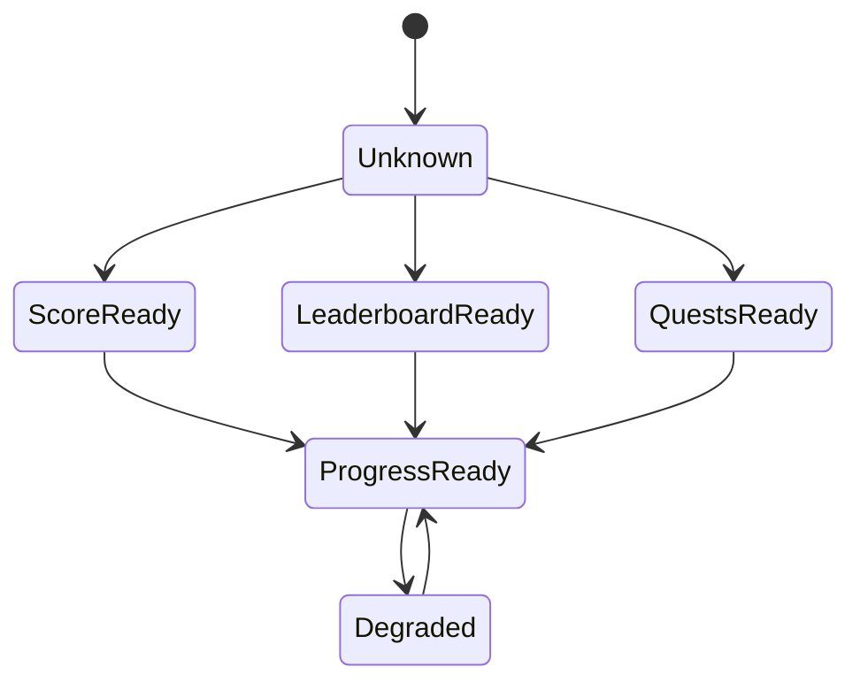
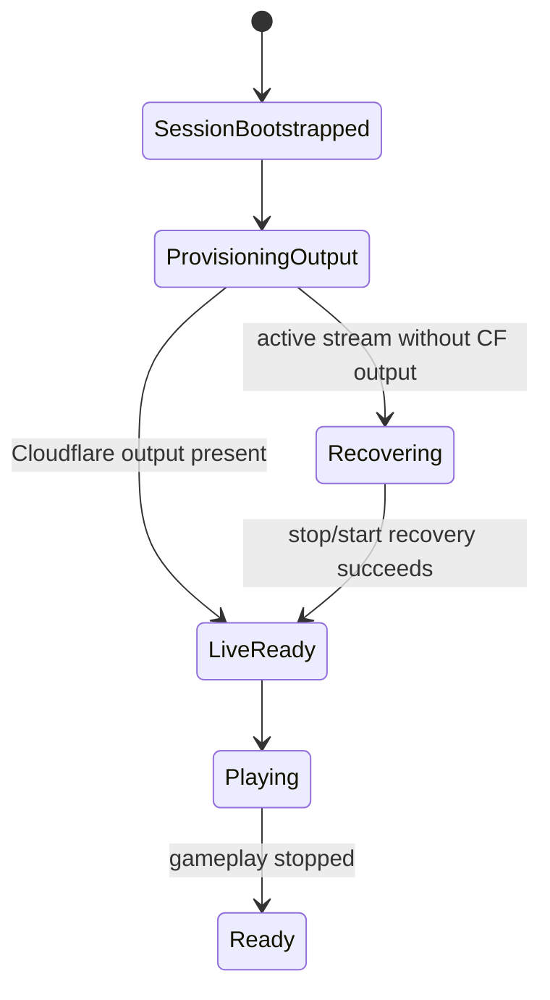

# 555 Arcade — States and Transitions

This is the public state reference for the `555 Arcade` plugin.

## Operator-visible lifecycle

## State meanings

| State | Meaning |
| --- | --- |
| `installed` | package exists in the host |
| `enabled` | host policy says it should load |
| `loaded` | `ArcadeControlService` is running |
| `authenticated` | arcade auth is valid |
| `sessionBootstrapped` | session exists and is bound |
| `catalogReachable` | game catalog read path is healthy |
| `ready` | the plugin can execute core arcade operations |
| `playing` | a game is active |
| `degraded` | plugin is up but one or more dependencies are impaired |

## Progress state

Signals:
- `scorePipelineReachable`
- `leaderboardReachable`
- `questsReachable`

## Live gameplay path

When using `ARCADE555_GAMES_GO_LIVE_PLAY`:

## Public rules

- `configured` must not be used as a synonym for `loaded`
- `ready` should imply auth + session + catalog readiness for the default operator flow
- progress readiness should not be collapsed into gameplay readiness
- mastery readiness is not the same thing as GA operator readiness
